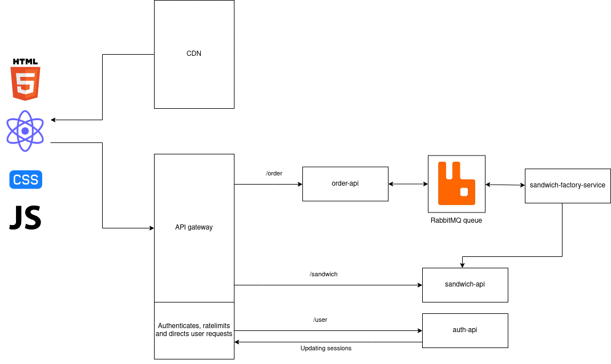

# Introduction

This is a website and a service for ordering sandwiches. Everything has been dockerized to make the system platform independent.

## Running

> docker-compose up

starts all the services and opens up ports `3000` and `8001` for the web server and the API gateway.

# Front-end

- **React** for the framework
- **NextJS** for compiling and optimization
- **Tailwind** for styling
- **Redux** for global state management

# Architecture and services

## Static file serving

The website is hosted on port 3000 on **NGINX** in a container. Please use a CDN for a real project 😩

## API gateway

Acts as a proxy for all services. Handles authentication, rate limiting, logging and firewalling API routes.

## Sandwich factory service

Makes sandwiches. The service might use the /sandwich API to get information about the sandwich types. This service is not scalable so there's a queue infront of it, implemented with **RabbitMQ**.

## Authentication service

Registers and logs users in. The API gateway handles session persistence.

## Database

The original plan was to implement saving authentication credentials and other data to MongoDB. Right now everything is volatile and disappears on a restart.

# How does the system work?

## Overview

Clients can either authenticate, browser all sandwiches or make an order. All of these actions have their own service. There's an API gateway infront of every service.

## Authentication

Clients can authenticate with the authentication API. The system handles session at the reverse-proxy. The microservices don't do their own authentication.

The authentication is done on the proxy and the usernames passed on HTTP headers to the backend. There's probably a more elegant solution to this.

## Ordering

Clients can send orders to the Sandwich factory service trough the /order API route. The client gets an immediate response that the order has started processing. The client keeps a socket connected and get's an update immediately when the sandwich is ready. This is implemented with **event-stream** and **EventSource**.

# Known problems

A lot of the microservices could have been replaced with serverless functions for more abstraction and efficiency.

There's no SSL certificates for anything. The system works on localhost for testing purposes.

Most of the URL's are hardcoded.

The localhost URL has been replaced with `*.local.gd`. It's a DNS service that maps to localhost.

There's no data persistence; sessions, orders and all other data will be gone once the service is restarted.

# About RabbitMQ

RabbitMQ is needed only for the queueing the orders. Piping everything trough it would be overhead -- especially since most of the services can be assumed to scale with the usage. Other APIs don't need the queue function before the service; they are assumed to always have enough capacity.

# Honorable mentions

Here are listed all the headaches that took more than four hours to completely solve. The good thing is next time it's only going to take two hours:
- CORS
- EventSource implementation
- Setting up redux
- SSL with localhost and other networking
- Did I mention CORS?
- Also CORS